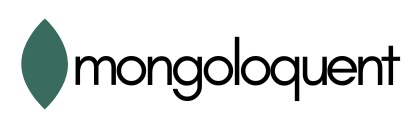
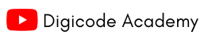

<p align="center">
    <a href="http://nestjs.com/" target="blank"></a>
    <br />
    
</p>

<p align="center">
    A lightweight <a href="https://mongodb.com" target="_blank">MongoDB</a> ORM library for Javascript/Typescript.
</p>

<p align="center">
<a href="https://www.npmjs.com/@mongoloquent/nestjs" target="_blank"></a>
<a href="https://www.npmjs.com/@mongoloquent/nestjs" target="_blank"></a>
<a href="https://www.npmjs.com/@mongoloquent/nestjs" target="_blank"></a>
<a href="https://github.com/sponsors/ajatdarojat45"  target="_blank"></a>

</p>

## Description

[Mongoloquent](https://mongoloquent.com/) module for [Nest](https://github.com/nestjs/nest).

## Installation

```bash
$ npm i --save @mongoloquent/nestjs mongoloquent mongodb
```

## Quick Start

[Overview & Tutorial](https://mongoloquent.com/docs/integrations/nestjs)

## Support

Mongoloquent is an MIT-licensed open source project. It can grow thanks to the sponsors and support by the amazing backers. If you'd like to join them, please [read more here](https://mongoloquent.com/docs/support).

### Sponsors

### Partners

<p align="center">
    <a href="https://youtube.com/@digicodeacademy" target="_blank">
    
    </a>
    <a href="https://ideacamp.id" target="_blank">
    
    </a>
</p>

## Stay in touch

- Author - [Ajat Darojat](https://linkedin.com/in/ajatdarojat45)
- Website - [https://mongoloquent.com](https://mongoloquent.com/)

## License

Mongoloquent is [MIT licensed](LICENSE).
